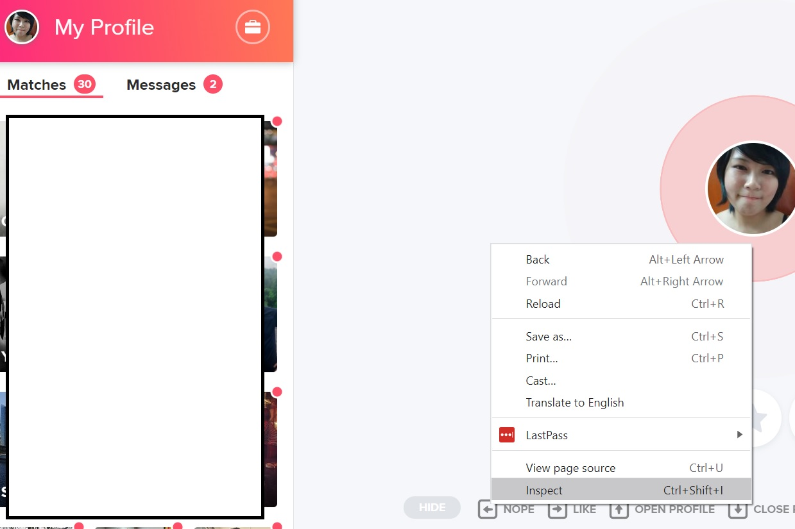
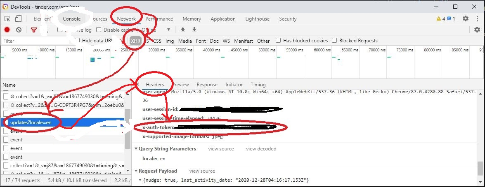
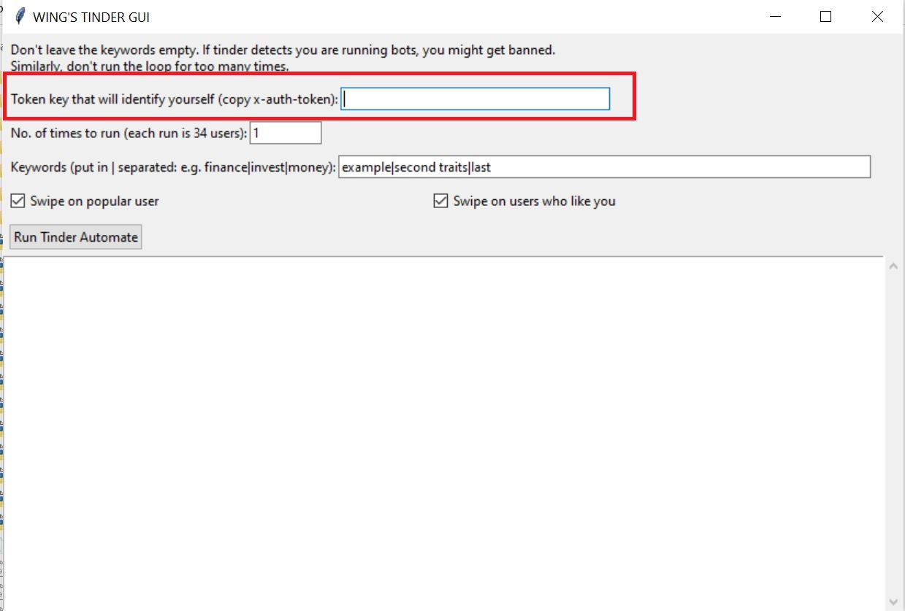
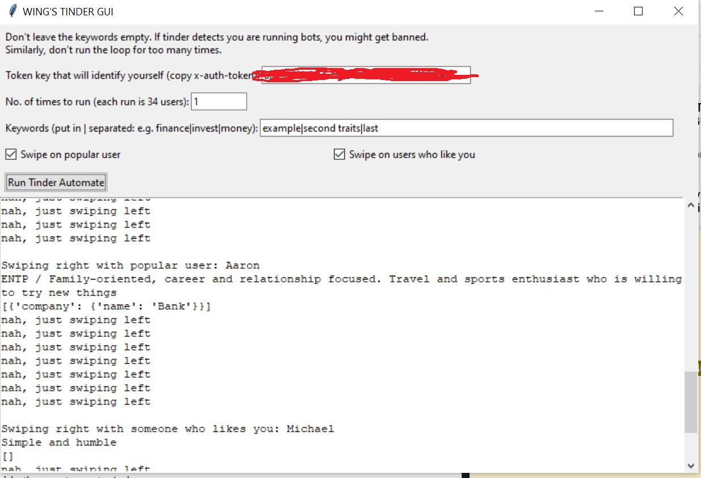
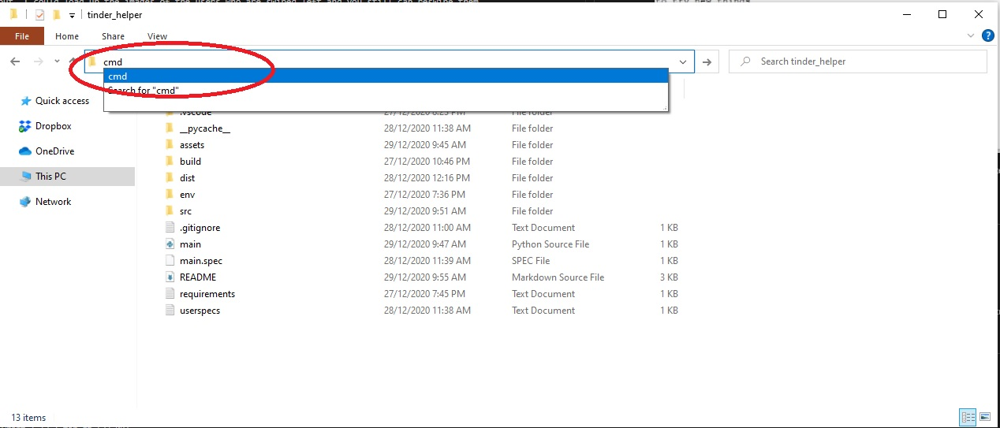
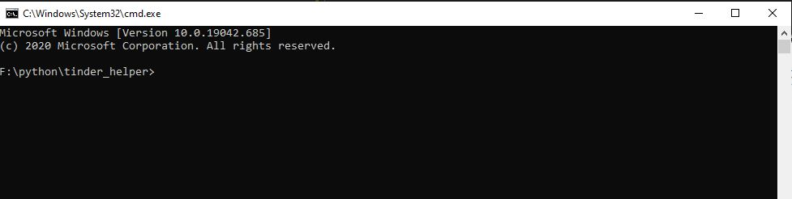
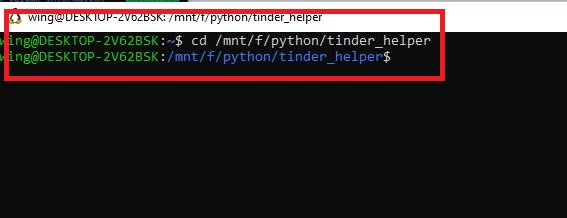
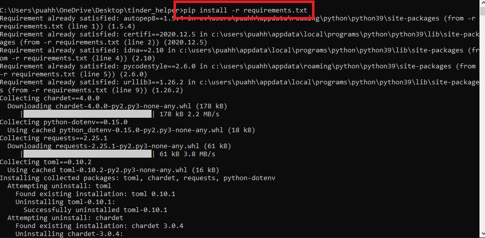

## Description

The `dist` folder GUI only runs on Windows. This program is compiled with PyInstaller and somehow, sometimes it get flags as virus from some anti-virus. If you are not on Windows or it gets flag as anti-virus, simply skip on to the bottom to [run the scripts manually](#run-the-scripts).

A GUI that allows you to automate your tinder swipe by the following:

- Text-based recgonition, keywords in jobs or bio. We don't scan the schools
- Option to swipe on popular user. They have a tag of "sprinkle" on their `user_rec` key
- Option to swipe on user who like you. They have a tag of "promoted_ml" on their `user_rec` key

# Run compiled code

Simply download this folder. Honestly, you just need the `dist` folder. But I'm too lazy to create this somewhere else.

## Steps after you download

1. We need to grab your auth key. Right click on your browser. Click Inspect
   

2. You will see a popup. click on the ones that is circled in red, in sequence. and copy whatever is in your x-auth-token. You have to always keep this key secret, don't let people get this key, otherwise, people could access your account.
   

3. Go to dist/main and click on main. A popup will appear. Paste the x-auth-token in the token key input, highlighted in red.
   

4. Fill up the rest of the info. And hit Run Tinder Automate. If you see an error in the textbox, let me know! When you hit run, it takes a while before the text appear. Be patient and trust the process! If you see an error, it might be also be because your token key expires, just repeat step 1 to 3.
   

5. I save your preference locally in your computer in the file `userspecs.txt`. I don't take your token key and data. The next time you reopen the program, it will be prepopulated with the items you key in.

# Run the scripts

This will require some familiarity with the command line. But fret not! It is easy to do so!

## Prerequisities

- Python [Download here](https://www.python.org/downloads/)
- pip [Read more](https://pip.pypa.io/en/stable/installing/)

1. If you are on windows, navigate to your folder of the project and key in `cmd` in the box circle below
   
   If you are on Mac, press the "Command" button and the space bar, simultaneously (this will open a search bar on your screen). Type "Terminal" and click it.

2. For windows user, you will immediately see a terminal with the file path.
   
   For mac users, you might have to navigate to your folder by keying in `cd <filepath>` as shown below. Please note that your filepath will be different from mine.

   

3. Run this command `pip install -r requirements.txt`. You will see the following output. It means the packages have install successfully. (For devs, you can set up virtual env for this and run the step. I'm skipping the portion over here.)
   

4. Run this command `python main.py`. Sometimes you might need to try `python3 main.py`. You will get the same popup as above. Do not close the terminal when you are using the popup. Closing the terminal will close the popup as well.
   

## Future updates I'm thinking of

If I have time, this is something that I want to work on.

- CSV output of the people who are swiped left on. Because we know we are physical creatures. With this CSV output, I could load up the images of the users who are swiped left and you still can reswipe them

- Recognition of a grouping of keywords

- Dialogflow integration for people who hates small talk. loll

**Notes**
(don't bother if you are not a dev)

The dependencies are in `requirements.txt`

activate virtual env

```
<foldername>\Scripts\activate.bat
```

pyinstaller

```
pyinstaller <filename.py> --noconsole
```
