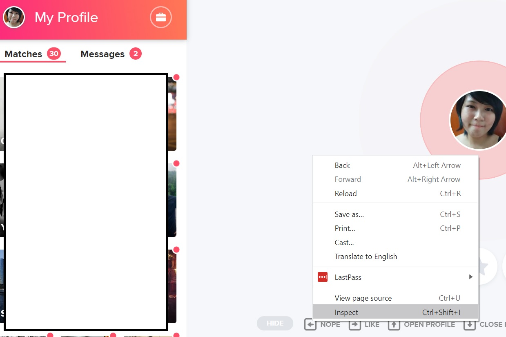

## Description

A GUI that allows you to automate your tinder swipe by the following:

- Text-based recgonition, keywords in jobs or bio. We don't scan the schools
- Option to swipe on popular user. They have a tag of "sprinkle" on their `user_rec` key
- Option to swipe on user who like you. They have a tag of "promoted_ml" on their `user_rec` key

Simply download this folder. Honestly, you just need the `dist` folder. But I'm too lazy to create this somewhere else.

## Steps after you download

1. We need to grab your auth key. Right click on your browser. Click Inspect
   

2. You will see a popup. click on the ones that is circled in red, in sequence. and copy whatever is in your x-auth-token. You have to always keep this key secret, don't let people get this key, otherwise, people could access your account.
   

3. Go to dist/main and click on main. A popup will appear. Paste the x-auth-token in the token key input, highlighted in red.
   

4. Fill up the rest of the info. And hit Run Tinder Automate. If you see an error in the textbox, let me know! When you hit run, it takes a while before the text appear. Be patient and trust the process!

## Future updates I'm thinking of

If I have time, this is something that I want to work on.

- CSV output of the people who are swiped left on. Because we know we are physical creatures. With this CSV output, I could load up the images of the users who are swiped left and you still can reswipe them

- Recognition of a grouping of keywords

- Dialogflow integration for people who hates small talk. loll

- Putting the files in a folder. haha, this I don't really care.

**Notes**
(don't bother if you are not a dev)

The dependencies are in `requirements.txt`

activate virtual env

```
<foldername>\Scripts\activate.bat
```

pyinstaller

```
pyinstaller <filename.py> --noconsole
```
